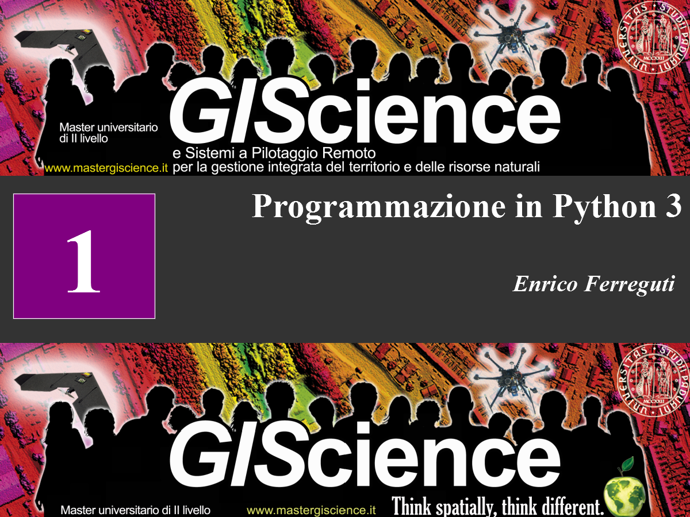
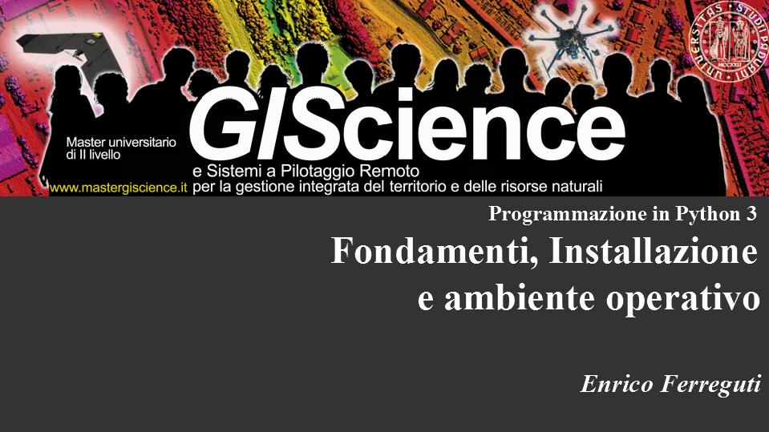
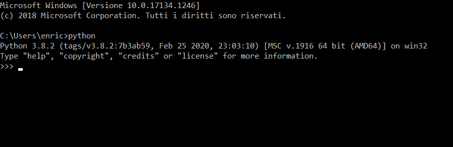
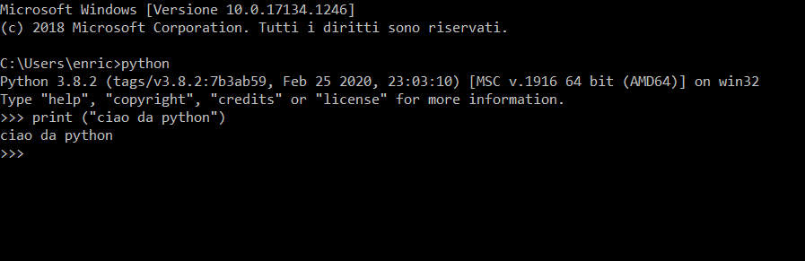

---



---

# PYTHON

Python è un linguaggio di programmazione potente e divertente, che trova utilizzo sia nello sviluppo di applicazioni web che di software desktop. E' possibile ritrovarlo come interfaccia di programmazione di librerie tipo GDAL/OGR, JTS e GEOS. Le caratteristiche principali sono:

* chiarezza e leggibilità della sintassi
* è orientato alla programmazione ad oggetti ma anche alla programmazione funzionale
* gestione degli errori in fase di esecuzione
* tipi dato dinamici e di alto livello
* codice modulare e riusabile
* disponibilità sterminata di librerie immediatamente disponibili (https://pypi.python.org/pypi)
* usato come linguaggio di *scripting* in molti software

--

## RISORSE

### Libri

* [Imparare Python, Roberto Allegra](https://www.dropbox.com/s/w35tl07jz9g47xo/Libro_ioProgrammo_122_Imparare_pyton_OK%281%29.pdf?dl=0)
* [Dive into python3](https://www.dropbox.com/s/cwgj1z3lj80qs3g/dive-into-python3.pdf?dl=0)

### Tutorial

* [Il tutorial ufficiale di Python](http://docs.python.it/html/tut/tut.html)
* [Pensare da informatico. Versione Python](http://www.python.it/doc/Howtothink/Howtothink-html-it/index.htm)
* [Dive into Python - Python per programmatori esperti](http://it.diveintopython.net/toc/index.html)
* [Google Python Course](https://developers.google.com/edu/python/)

### Riferimenti

* [Cheatsheet - riferimento rapido python 3.5](https://perso.limsi.fr/pointal/_media/python:cours:mementopython3-english.pdf)
* [The Hitchhiker’s Guide to Python](https://docs.python-guide.org/ )

---

## INSTALLAZIONE
Python è usato come linguaggio di scripting all'interno di altri software (per esempio ArcGis e QGIS per restare nell'ambito geospaziale) e di solito la prima esperienza di questo linguaggio è in relazione a questi programmi per realizzare personalizzazioni o processi automatizzati.
Il linguaggio però può essere installato in modo *standalone* scaricando l'interprete dal seguente indirizzo: https://www.python.org/downloads/

Mentre in Linux e MacOS Python è maggiormente integrato nel sistema operativo mentre in Windows è più facile far coesistere diverse versioni differenti, ma fondamentalmente l'esperienza è fondamentalmente la stessa ed eventuali differenze sottostanti sono gestite dall'interprete in modo da eliminare o quanto meno limitare al minimo le incompatibilità tra vari sistemi. (per esempio: [os](https://docs.python.org/3/library/os.html))

Si può affermare che un codice Python può funzionare con opportuni accorgimenti in tutti i sistemi operativi. 

---

Controlliamo se tutto è a posto. apriamo una finestra di comando e digitiamo il comando python e dovrebbe comparire il tipico pronto della console del linguaggio : >>>



---

## STRUMENTI

In Python la leggibilità del codice è considerata un valore essenziale [(PEP8)](https://www.python.org/dev/peps/pep-0008/) ed arriva ad attribuire all'indentazione delle istruzioni una precisa funzione sintattica. E' quindi necessario disporre di un'editor di testo per programmatori che faciliti l'indentazione evitando situazioni che protrebbero portare ad errori (per esempio mescolare tabulazioni e spazi), oltre a permettere l'evidenziazione della sintassi ed un minimo di introspezione del codice.

Noi utilizzeremo l'editor [IDLE](https://docs.python.org/3/library/idle.html), realizzato completamente in Pyhton () e che presenta un'interfaccia semplice, una console integrata un debugger semplice studiato dalla comunità Python proprio per finalità educative e che viene installato insieme all'interprete del linguaggio

In alternativo possono essere scaricati in rete altri ambienti integrati di sviluppo (IDE) più complessi, adatti a sviluppare applicazioni professionali:

- [GEANY](https://www.geany.org/) - [ATOM](https://atom.io/) - [BRACKETS](http://brackets.io/) - [VISUAL STUDIO CODE](https://code.visualstudio.com/)

---

## VERSIONI DEL LINGUAGGIO

Python nel corso della sua evoluzione è arrivato ormai release 3.8.2 della versione 3 e la versione 2 non è più supportata anche se ancora comunemente utilizzata (ArcGis 10)

Non supportato non significa che non funziona più ma che l'attività di bugfixing è cessata e di conseguenza eventuali vulnerabilità non saranno più corrette esponendo i sistemi a malfunzionamenti ed attacchi informatici

[informazioni sulla migrazione](https://docs.python.org/3/howto/pyporting.html)

---

## DOVE E' PYTHON

Contrariamente ai linguaggi [compilati](https://it.wikipedia.org/wiki/Linguaggio_compilato), che servono a produrre per mezzo di un compilatore un programma in linguaggio macchina, direttamente eseguibile da un microprocessore, Python è un linguaggio [interpretato](https://it.wikipedia.org/wiki/Linguaggio_di_programmazione#Interpretazione), ovvero che deve essere eseguito da un programma interprete.

I programmi in Python sono constituiti da file di testo con estensione .py che contengono le istruzioni da eseguire dall'interprete Python che è un eseguibile che valida il codice per evidenziare errori di sintassi, ovvero difformità dallo standard del linguaggio, ed appunto "interpreta" le istruzioni riga per riga svolgendo le funzionalità richieste con delle procedure interne all'interprete.

Un'altra modalità di funzionamento è quello da console, cioè digitando riga per riga i comandi da eseguire, una modalità utile per testare i comandi o gli ambienti in cui vengono eseguiti i programmi python

--

## LA RIGA DI COMANDO

Ai fini del corso viene utilizzato l'interprete di python  installato assieme a QGIS. Nei sistemi Linux e Macos, che hanno una migliore gestione dei pacchetti di installazione, python è installato come parte del sistema operativo, mentre nei sistemi Windows è installato come applicativo assieme a QGIS, come applicazione e non come parte del sistema operativo. Questo significa che potrebbero coesistere anche molte versioni di Python all'interno della macchina, causando la necessità di configurare opportunamente l'ambiente di esecuzione per evitare conflitti ed errori.

* In Linux e Macos, basta aprire il terminale e digitare `python`  per entrare nell'interprete a riga di comando (oppure `python2` o `python3`)

* In windows bisogna tralasciare la console di sistema, ma andare sul menu di installazione di QGIS e cliccare su *OSGeo4W Shell* e digitare i comandi `py2_env.bat`  o `py3_env.bat`a seconda che si desideri usare la versione 2 o 3 ed a questo punto digitare `python`

--

## CIAO MONDO!

```python
>>> print ("CIAO DA PYTHON!") <invio>
```

print è una funzione i cui parametri sono contenuti dalle parentesi ()
Nel nostro caso il parametro è unico ed è costituito da una stringa di testo da stampare sulla console. Dovremmo ottenere il seguente risultato



---

# Il linguaggio PYTHON

* I tipi di dati

* le variabili

* i tipi strutturati

* il controllo del flusso di esecuzione

* funzioni, moduli e namespaces

* programmazione ad oggetti

#### THE ZEN OF PYTHON

```python
>>> import this
```

---

# I TIPI DI DATI

--

## Numeri

```python
10     #integer (numero intero)
25.45    #float (numero decimale)

# Per trasformare una stringa in numero
# o troncare un float
int("10")
int(34.354)

# L'aritmetica ha una notazione convenzionale
10 + 1
10 * 5
10*(45/3)+8*17

# Divisione tra interi in python 2
5 / 2 #2

# se uno dei numeri è float il risultato è float
10 / 3.0

# questo è equivalente a sopra
10 / float(3)

# in python 3 il risultato è implicito
```

--

## Stringhe

```python
#una stringa è una sequenza alfanumerica racchiusa tra apici '' o virgolette ""

# Concatenare le stringhe
"Ciao" + " " + "Mondo!"

# Formattazione di stringhe
"Ciao %s" % "Mondo!"

# Il testo è racchiuso da virgolette singole o doppie
'Python è "divertente"'

# Stringhe multi-linea
print ("""Questa stringa
è suddivisa in
varie righe""")

# sequenze di escape precedute da barra inversa "\"
print ("Questa stringa\nviene stampata\nin tre righe")
print ("Python è \"divertente\"")
print ("C:\\Users\\enrico")

# Si può usare una stringa grezza tralasciando le sequenze di escape
print (r"C:\Users\enrico")

#Uso del set di caratteri esteso (unicode - UTF8) (Python 2)
print (u"questo è qgis")
```

--

## formattazione delle stringhe

il linguaggio dispone di [funzioni molto potenti](https://pyformat.info/) per assemblare tra loro le stringhe e formattare tipi non stringa (numeri, date)

```python
a = 'Paolo'
b = "Verdi"
c = 172
d = 8.5676776
# concatenazione
print (u"il mio cognome è " + b)
print ("mi chiamo "+a+" "+b+" alto "+str(c)+" cm ed ho percorso "+str(d)+" km")
# metodo "vecchio"
print (u"il mio cognome è %s" % b)
print ("mi chiamo %s %s alto %d cm ed ho percorso %.1f km" % (a,b,c,d))
#metodo "nuovo"
print ("mi chiamo {1} {0} alto {2:d} cm ed ho percorso {3:.1f} km".format(a,b,c,d))
```

--

## TIPO *Boolean*

```python
True

False #(None, [], {})

# operatori
not True # False
True and True # True
True and False # False
False and False # False
False or True # True
not (True or False) and True #False

1 == 1 #operatore di uguaglianza
1 != 1 #operatore di diversità
2 > 1  #maggiore
2 >= 1  #maggiore o uguale
1 < 2  #minore
1 <= 2  #minore o uguale
```

---

# VARIABILI

--

## Variabili

```python

anno = "2017"

anno = 2017

print (anno)

anno_scorso = anno - 1

print (anno_scorso)
```

Le variabili in python hanno non sono "staticamente tipizzate", ovvero non devono essere dichiarate prima di usarle ne deve essere dichiarato il tipo. Sono dei contenitori che puntano a oggetti che potenzialmente possono essere di qualunque tipo. per conoscere il tipo dell'oggetto assegnato ad una variabile si usa type

```python
type(anno)

<type 'int'>
```

--
# Nomi delle variabili

- ogni nome di variabile deve iniziare con una lettera o con il carattere underscore (_), e può essere seguita da lettere, numeri, o underscore;
- i nomi delle variabili sono **case_sensitive**, ovvero distingue tra maiscole e minuscole
- python riserva alcune parole che non possono essere usate come variabili e che hanno un'altro significato nel contesto del programma (for, if, while, class, function ......)
- 

---

# I TIPI *STRUTTURATI*

--

## Liste

una lista (list) e' un elenco ordinato di elementi, iterabile.

```python
l = [3, 5, 4, 2, 1]
m = [[[0,3],[4,6],[5,7]],[[4,5],[6,8]]]

# Accesso agli elementi per posizione
# il primo elemento è 0, gli indici negativi partono dalla fine

l[0]       #3
l[0:3]     #[3, 5, 4]
l[-1]      #1
l[2:-2]    #[4, 2]
l[3:]      #[2, 1]
l[:-2]     #[3, 5, 4, 2]
m[0][2][0] #5
m[1][1]    #[6,8]
```

la stessa notazione è valida per ricavare sottostringhe

```python
"abcdefghijklmnopqrstuvwxyz"[-5:] # "vwxyz"
```

--

## Dizionari

un dizionario (dict) è un insieme strutturato di dati, iterabile.

```python
d = {
    "chiave1": 10,
    "chiave2": 234.56,
    "chiave2": "contenuto",
    "chiave3": {
        "chiave3_1": "abcdef",
        "chiave3_2": "xyz"
    }
}

d["chiave2"]               # 234.56
d["chiave3"]["chiave3_2"]  # "xyz"
```

--

## Manipolazione dei dati strutturati

```python
l0 = [] # lista vuota
l1 = [1, 2]
l2 = [3, 5, 6]

d0 = {} # dizionario vuoto
d1 = {"nome":"giuseppe", "anni": 50}

l1 + l2         # [1, 2, 3, 5, 6]
l1 + 4 + l3     # TypeError
l1.append(10)   # [1, 2, 3, 5, 6, 10]
l1.append(l2)   # [1, 2, [3, 5, 6]]
3 in l2         # True
3 in l1         # False
len(l1 + l2)    # 5

d1["cognome"] = 'verdi'
d1["anni"] = 60 # {"nome":"giuseppe","anni":60,"cognome":"verdi"}
d1.keys()       # ["cognome", "anni", "nome"]
d1.values()     # ["verdi", 60, "giuseppe"]
len(d1)         # 3
```

---

# Controllo del flusso

--

## ESECUZIONE DI UN PROGRAMMA PYTHON

Le istruzioni Python possono essere memorizzate  in un file di testo con estensione .py ed essere eseguite in sequenza. L'esecuzione di un file .py può avvenire da riga di comando digitando 

```shell
python file.py
```

Usando IDLE il programma può essere eseguito direttamente dall'editor ed il relativo l'output può essere esaminato sulla finestra di shell.

Le istruzioni Python sono eseguite sequenzialmente una riga alla volta una dopo l'altra ma il flusso di esecuzione può essere modificato mediante le istruzioni IF / FOR / WHILE / TRY

--

## LEGGIBILITA' DEL CODICE

Come accennato, In Python la leggibilità del codice è un valore fondamentale. Mentre In altri linguaggi l'identificazione dei blocchi di codice che compongono il programma è effettuata con caratteri o parole chiave ( per esempio **{}** parentesi graffe in C++/java/javascript o BEGIN / END in Pascal) in Python questa funzione è svolta dall'indentamento testuale del codice realizzato per mezzo di spaziature o tabulazioni.

Questa caratteristica deve essere gestita con editor adeguati che permettono di non mescolare spazi e tabulazioni ed evitare errori sintattici inaspettati.

Altri aspetti di stile sono poi definiti nella direttiva [(PEP8)] (https://www.python.org/dev/peps/pep-0008/) che non è sintatticamente prescrittiva ma largamente utilizzata negli strumenti di *linting* ovvero i programmi per l'analisi automatica del codice

--

## IF THEN ELSE

```python
latitude = 51.5
if latitude >= 0:
   zone_letter = 'N'
else:
   zone_letter = 'S'

print (zone_letter)
```

* l'indentazione è il sistema con cui Python raggruppa le istruzioni
* L'indentazione viene realizzata con spazi o tabulazioni
* ogni riga all'interno di un blocco base dev'essere indentata in ugual misura
* Usando un buon editor di testo per programmatori, copiare questo testo in un file vuoto, sa

--

## CICLI

```python
#for ELEMENTO in ITERABILE(LIST, DICT)
for carattere in "abcdefg":
    print (carattere)

for numero in [3, 5, 4, 2, 1]:
    print (numero)

#while CONDIZIONE_VERA(TRUE)
testo = "abcdefg"
while testo:
    testo = testo[:-1]
    print (testo)
```

un ciclo può essere interrotto con `break`

e si può saltare un'iterazione con `continue`

--

## Eccezioni

Il debugging è una parte dell'attività di programmazione che mira ad individuare, interpretare e risolvere gli errori presenti codice da eseguire. 

L'editor IDLE possiede un semplice **debugger** che consente di eseguire passa-passo di un programma ed analizzare il valore degli oggetti man mano che sono assegnati o modificati.

In Python esistono due tipi di errori:

- errori di sintassi; che impediscono l'esecuzione di un programma
- errori *runtime* o eccezioni; che avvengono durante lo svolgimento del programma e che possono interrompere il flusso dello stesso o essere gestite per isolare il codice che potenzialmente potrebbe generarle ed adottare strategie alternative mirate.


--

#### Errore di Sintassi

```shell
>>> print( 0 / 0 ))
  File "<stdin>", line 1
    print( 0 / 0 ))
                  ^
SyntaxError: invalid syntax
```

#### Eccezione

```shell
>>> print( 0 / 0)
Traceback (most recent call last):
  File "<stdin>", line 1, in <module>
ZeroDivisionError: integer division or modulo by zero
```

--

#### Eccezioni comuni

###### NameError: 

```shell
>>> print (c)
Traceback (most recent call last):
File "<pyshell#17>", line 1, in <module>
print (c)
NameError: name 'c' is not defined
```

###### TypeError:

```shell
>>> print(4+"a")
Traceback (most recent call last):
  File "<pyshell#19>", line 1, in <module>
    print(4+"a")
TypeError: unsupported operand type(s) for +: 'int' and 'str'
```

[Eccezioni *Built-in*](https://docs.python.org/3/library/exceptions.html#exception-hierarchy)

--

## Exception handling

In Pyhton le eccezioni possono essere gestite e manipolate mediante alcuni potenti comandi predefiniti:

* **raise** consente di creare una eccezione personalizzata e bloccare l'esecuzione del programma
* **assert** per bloccare in modo condizionato l'esecuzione di un programma
* **try except else finally** per eseguire parti di codice in alternativa ad altre che determinano un eccezione

--

```python
n = 2000
if n > 1000:
    raise Exception('n è {} ma non dovrebbe superare 1000'.format(n))

a = "abc"
assert(type(a) == int) , "a deve essere un numero"
print (a * 10)

try:
    print (100/0) #provoca ZeroDivisionError: integer division or modulo by zero
except:
    print ("il codice contenuto in try provoca un errore")

try:
    print (100/0)
except Exception as e:
    print ("il codice contenuto in try provoca l'errore" + str(e))
```

---

# ESERCITAZIONI


--

### TROVA I FATTORI DI UN NUMERO INTERO

```python
num = 320

print("I fattori del numero",num,"sono:")
for i in range(1, x + 1):
    if x % i == 0:
    	print(i)

```

--

### TEST NUMERO PRIMO

```python
num = 407

# I numeri primi sono più grandi di 1
if num > 1:
   # cerca il minimo comune divisore
   for i in range(2,num):
       if (num % i) == 0:
           print(num,"non è un numero primo")
           print(i,"volte",num//i,"è uguale a",num)
           break
   else:
       print(num,"è un numero primo")
else:
   print(num,"non è un numero primo")
```

--

### CONTA LE VOCALI PRESENTI IN UNA STRINGA

```python
stringa = "l'aida di giuseppe verdi"

# Inizializza un contatore 
conta = 0
# Creating a set of vowels 
vocali = "aeiouAEIOU" 
# cicla attraverso tutti i caratteri di una stringa
for car in stringa: 
    # Se il carattere è presente aumenta il contatore
    if car in vocali: 
        conta = conta + 1

print("Numero di vocali:", conta) 
```

--

### TEST TROVA N VALORI MAGGIORI DI UNA LISTA

```python
lista_iniziale = [2,4,66,7,8,12,89,3,4,1,90,45,8,34,5,6,77,84]
N = 4

lista_finale = [] 
 
for i in range (0, N): 
  max1 = 0
   
  for j in range(len(lista_iniziale)):   
    if lista_iniziale[j] > max1: 
      max1 = lista_iniziale[j]; 
       
  lista_iniziale.remove(max1); 
  lista_finale.append(max1) 
   
print(lista_finale) 
```


--

### ORDINAMENTO *BUBBLE SORT*

```python
lista = [3,5,2,7,44,6,44,3,46,4,67,23,67,5,3,9,56,23,67,0,1,76,4]

n = len(lista)

# Attraversa tutti gli elementi della lista
for i in range(n):

    # Gli ultimi i elementi
    for j in range(0, n-i-1):
    
        # attraversa l'array da 0 a n-i-1
        # scambia gli elementi a coppie quando
        # il primo elemento è più grande di quello dopo
        if lista[j] > lista[j+1] :
            lista[j], lista[j+1] = lista[j+1], lista[j]
print (lista)
```

