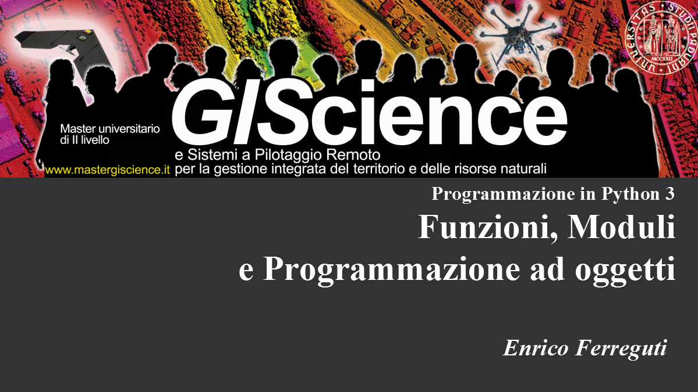

---


# Funzioni, moduli e namespaces

--

## Funzioni esistenti (o predefinite)

le funzioni in python sono delle azioni di trattamento dei dati definite da un nome e degli argomenti da trattare separati da virgole e racchiusi tra parentesi. Le funzioni possono o meno restituire un valore di risposta.

```python
# Funzioni esistenti (o predefinite)
print("stampa il numero",4)
sorted([3, 5, 4, 2, 1])
len(l1 + l2)
type(a)
globals()
```

--

## Definizione della propria funzione

```python
def ZonaUtm(longitudine, latitudine):
    numero_zona = ((longitudine + 180) / 6) % 60 + 1
    if latitudine >= 0:
        lettera_zona = 'N'
    else:
        lettera_zona = 'S'
    return '%d%s' % (int(numero_zona), lettera_zona)
```

### Uso della funzione

```python
ZonaUtm(11.55,45)   # 32
```

--

## Namespaces

ogni oggetto in python *vive* all'interno di un blocco predeterminato di istruzioni, chiamato *namespace*e che idealmente corrisponde al livello di indentazione nel quale viene creato l'oggetto riferito agli oggetti *def* e *class*

All'interno di un programma possono coesistere numerosi namespaces separati tra loro in cui i nomi degli oggetti non sono in conflitto. Esiste almeno un namespace globale che contiene gli oggetti richiamabili da ogni parte del programma

```python
def funzione1():
    var = 100
    print (var)

var = 50
print (var)
funzione1()
```

output:

```python
50
100
```

```python
globals() #simboli accessibili globalmente
locals() #simboli privati accessibili localmente (all'interno di una funzione)
```

--

## test sui namespaces

```python
a = 0
b = 1
c = 2

def stampa (a, b, c):
    print ('a:',a,'b:',b,'c:',c)

def test1():

    def test2(a,b,c):
        a += 1
        b += 1
        c += 1
        stampa(a, b, c)

    a = 6
    b = 5
    stampa(a, b, c)
    test2(a, b, c)

test1()
stampa(a, b, c)
```

--

## Moduli

I moduli sono collezioni strutturate ed organizzate di codice python le cui definizioni possono essere importate all'interno di un programma

```python
# Importa un modulo con chiamata ad una funzione contenuta
import math
math.floor(10.6)

# Importa singoli elementi da un modulo
from os import path
path.join('C:', 'Utenti', 'paolo', 'documenti')
'C:/Utenti/paolo/documenti'
```

l'organizzazione modulare è una delle caratteristiche del linguaggio. I moduli possono essere:

* predefiniti, già compresi nella [dotazione di base del linguaggio](https://docs.python.org/3/library/index.html)
* esterni, contenuti nei path di sistema di Python (PATH, PYTHONPATH). Possono essere preimportati o [importati da internet](https://pypi.python.org/pypi?%3Aaction=browse) tramite pip/setuptools
* definiti localmente dall'utente in altri files python


---

## Decoratori

In Python le funzioni sono considerate esse stesse degli oggetti infatti:

```
>>> math.sin
<built-in function sin>
```

e questo significa che:

- Possono essere passate come argomenti ad altre funzioni

- Possono essere definite all'interno di altre funzioni ed essere restituite come output di funzione

I Decoratori sono strumenti molto utili in Python che permettono ai programmatori di modificare il comportamento di una funzione o di una classe. I decoratori consentono di incapsulare una funzione dentro l'altra modificando il comportamento della funzione incapsulata senza modificarla permanentemente.

--

### Sintassi dei decoratori

Nel codice seguente mio_decorator è una funzione *callable* ovvero chiamabile, invocabile, che aggiungerà l'esecuzione di qualche codice all'etto dell'esecuzione della funzione XYZ

```python
@mio_decorator
    def XYZ():
    print ( "XYZ" )
```

ed equivale alla seguente funzione

```python
def XYZ(): 
    print("XYZ") 

hello_decorator = mio_decorator(hello_decorator)
```

--

Per esempio con un decoratore si può calcolare il tempo di esecuzione di una funzione:

Attenzione il nome riservato `args `restituisce la lista degli argomenti passati a quella funzione e  `*` trasforma una lista in una sequenza di argomenti mentre il nome riservato `kwargs `restituisce la lista degli argomenti opzionali (*key-worded arguments*)passati a quella funzione e `**` trasforma una lista in una sequenza di argomenti opzionali. e la costruzione `*args, **kwargs` significa tutti gli argomenti che una funzione potrebbe avere

```python
# importing libraries 
import time 
import math 

def calcola_tempo_esecuzione(func): 

    def funzione_incapsulante(*args, **kwargs): 

        begin = time.time() 
        valore_ottenuto = func(*args, **kwargs) #se la funzione ritorna un valore si conserva per restuirlo poi
        end = time.time() 
        print("Tempo totale di esecuzione della funzione", func.__name__, end - begin) 
    return valore_ottenuto 

    return funzione_incapsulante 


@calcola_tempo_esecuzione
def fattoriale(num): 

    # imponiamo una pausa di due secondi per poter rendere evidente il tempo
    time.sleep(2) 
    print(math.factorial(num)) 

fattoriale(10)
```

---

# Classi ed istanze

* Classe
  * tipo di dato composto definito dall'utente in metodi ad attributi.
* Istanziare
  * creare un'oggetto di una determinata classe.
* Istanza
  * un'oggetto creato che appartiene ad una classe.
* Membri di una classe
  * Metodi
    * funzioni che costituisce un comportamento dell'istanza
  * Attributi
    * valori attribuiti ad un'istanza.
* Costruttore
  * metodo usato per definire nuovi oggetti.

--

## definizione di classe e membri

```python
class rettangolo:

   l = 0
   h = 0

   def __init__(self, l, h):
      self.l = l
      self.h = h

   def area(self):
      return self.l*self.h

   def perimetro(self):
      return(self.l+self.h)*2

   def scala(self, scala):
      self.l = self.l*scala
      self.h = self.h*scala
```

--

## instanziare una classe

Una volta definita una classe è possibile .....

```python
 r = rettangolo(10,5) #istanziazione di un oggetto rettangolo
 r.area()             #50
 r.scala(2)
 r.perimetro()        #60
 r.l                  #20
 r.h                  #10
```

--

## Ereditarietà

è la capacità di definire una nuova classe come versione modificata di una classe già esistente

```python
class stanza:

    def __init__(self, lung, larg):
        self.lung = lung
        self.larg = larg
        self.nome = "stanza"
    def nome(self):
        return self.nome
    def area(self):
        return self.lung * self.larg

class cucina(stanza):

    def __init__(self, lung, larg):
        super().__init__(lung, larg)
        self.nome = "cucina"

class camera(stanza):

    def __init__(self, lung, larg, abitante):
        super().__init__(lung, larg)
        self.nome = "bagno"
        self.abitante = abitante

class edificio:

    def __init__(self, stanze):
        self.stanze = stanze

    def area_tot(self):
        area = 0
        for stanza in self.stanze:
            area += stanza.area()
        return area

    def abitanti(self):
        ab = 0
        for stanza in stanze:
            if hasattr(stanza,'abitante'):
                ab += 1
        return ab
```

--

## ispezione degli oggetti

individuazione del tipo di oggetto

```python
type(oggetto)
```

lista dei membri di un' oggetto

```python
dir(oggetto)
```

restituzione di un attributo di un oggetto con il suo nome

```python
getattr(oggetto,'membro')
```

test se un attributo è presente nell'oggetto

```python
hasattr(oggetto,'membro')
```

---

# Esercitazione 1

calcolo delle abbreviazioni del nome e del cognome del codice fiscale italiano:

* scomposizione di una stringa in vocali e consonanti
* uso delle consonanti in successione, e se non sufficienti uso delle vocali in successione

--

```python
# -*- coding: utf-8 -*-
'''
CORSO DI GEOPROCESSING - MASTER IN GISSCIENCE
calcolo delle abbreviazioni del nome e cognome del codice fiscale
'''

import string

VOCALI = [ 'A', 'E', 'I', 'O', 'U' ]
CONSONANTI = list(set(list(string.ascii_uppercase)).difference(VOCALI))

def scomposizione(stringa):
    '''
    scomposizione nelle liste di consonanti e vocali che compongono la stringa in input
    '''
    stringa = stringa.upper().replace(' ', '')

    consonanti = []
    for car in stringa:
        if car in CONSONANTI:
            consonanti.append(car)

    vocali = [ car for car in stringa if car in VOCALI ]
    return consonanti, vocali

def abbreviazione(stringa):
    scomposizione_in_consonanti, scomposizione_in_vocali  = scomposizione(stringa)
    sequenza = scomposizione_in_consonanti
    while len(sequenza) < 3: #se la lunghezza è meno di 3 significa che le consonanti non bastano e servono le vocali
        try: # pop toglie alla lista il primo elemento e lo restituisce
            sequenza.append(scomposizione_in_vocali.pop(0))
        except: # appende X per stringhe brevi
            sequenza.append('X')
    return ''.join(sequenza[:3]) # trasformazione della lista risultante in stringa


nomi_da_abbreviare = ['Paolo', 'Riccarco', 'Alessia', 'Luisa', 'Ada', 'Liu', 'Bo']

for nome in nomi_da_abbreviare:
    print (nome, abbreviazione(nome))
```

[esercitazione1.py](py/esercitazione1.py)

---

# Esercitazione 2 e 3

scrittura e lettura di un file di testo

--

## Scrittura

```python
'''
CORSO DI GEOPROCESSIGN - MASTER IN GISSCIENCE
salvataggio di una stringa ad un file di testo
'''

import os

testo = '''
Lorem ipsum dolor sit amet, consectetur adipiscing elit. 
Ut laoreet sem pellentesque ipsum rutrum consequat. Nunc iaculis tempor aliquet. 
Fusce imperdiet pharetra tellus, ut commodo lacus gravida et.
'''

destinazione = r"C:\Users\paolo\Documenti"

text_file = open(os.path.join(destinazione, 'mio_file.txt'), 'w')
text_file.write(testo)
text_file.close()
```

[esercitazione2.py](py/esercitazione2.py)

```python


--

## Lettura

​```python
'''
CORSO DI GEOPROCESSING - MASTER IN GISSCIENCE
lettura di una stringa da un file di testo
'''

import os
#from esercitazione2 import destinazione
destinazione = r"C:\temp\"


text_file = open(os.path.join(destinazione, 'mio_file.txt'), 'r')
testo = text_file.read()
text_file.close()

print (testo)
```

[esercitazione3.py](py/esercitazione3.py)

---

# Esercitazione 4

stampare un'albero di files e directory. uso delle funzioni os:

* [os.path()](https://docs.python.org/3.6/library/os.path.html)
* [os.walk()](https://docs.python.org/3.6/library/os.html#os.walk)
* [os.listdir()](https://docs.python.org/3.6/library/os.html#os.listdir)

--

```python
'''
CORSO DI GEOPROCESSING - MASTER IN GISSCIENCE
procedura per stampare l'albero di files e directory
'''

import os

dir_sorgente = r"inserire un path"

print ("\nmetodo1")
for root, dirs, files in os.walk(dir_sorgente):
    for file in files:
        print(os.path.join(root,file))

print ("\nmetodo2")
def attraversa_dir(path, livello=0):
    file_e_dir = os.listdir(path)
    for elem in file_e_dir:
        spaziatura =' '*livello*4
        if os.path.isdir(os.path.join(path,elem)):
            print (spaziatura + '['+elem+']')
            attraversa_dir(os.path.join(path,elem), livello=livello + 1)
            print ()
        else:
            print (spaziatura+elem)

attraversa_dir(dir_sorgente)
```

[esercitazione4.py](py/esercitazione4.py)

---

# Esercitazione 5

calcolo della lunghezza di un segmento espresso come lista di punti con metodi diversi:

--

```python
'''
CORSO DI GEOPROCESSING - MASTER IN GISSCIENCE
calcolo della lunghezza di un segmento espresso come lista di punti
'''
import math

def lunghezza(segmento):
    lunghezza_tot = 0
    for indice in range(0, len(segmento)):
        if indice == 0:
            pass
        else:
            x2 = segmento[indice][0]
            x1 = segmento[indice-1][0]
            y2 = segmento[indice][1]
            y1 = segmento[indice-1][1]
            lunghezza_tot += math.sqrt((x2-x1)**2 + (y2-y1)**2)
    return lunghezza_tot

def lunghezza_elegante(segmento):
    lunghezza_tot = 0
    for indice, p2 in enumerate(segmento):
        if indice == 0:
            pass
        else:
            lunghezza_tot += math.hypot(p2[0]-p1[0], p2[1]-p1[1])
        p1 = p2
    return lunghezza_tot

def lunghezza_pitonica(segmento):
    print (zip(segmento[:-1],segmento[1:])
    diffpt = lambda p: (p[0][0]-p[1][0], p[0][1]-p[1][1])
    lista_diff = map (diffpt, zip(segmento[:-1],segmento[1:]))
    lunghezza_tot = sum(math.hypot(*d) for d in lista_diff)
    return lunghezza_tot

polilinea = [[1.3,3.6],[4.5,6.7],[5.7,6.1],[2.9,0.6],[3.4,2.1],[9.5,2.7]]

print ("lunghezza",lunghezza(polilinea))
print ("lunghezza_elegante",lunghezza_elegante(polilinea))
print ("lunghezza_pitonica",lunghezza_pitonica(polilinea))

for nome_funzione in ['lunghezza', "lunghezza_elegante", "lunghezza_pitonica"]:
    print (nome_funzione, globals()[nome_funzione](polilinea))
```

[esercitazione5.py](py/esercitazione5.py)


---

# ESERCITAZIONE PER CASA

Scrivere una procedura per scansionare il contenuto di una cartella e caricare tutti gli shapefiles in essa contenuti in un unico archivio geopackage. Spunti per lo svolgimento

- scansionare il contenuto di una directory con [os.listdir](https://code-maven.com/listing-a-directory-using-python)
- estrarre l'estensione da un nome del file con [os.path.splitext](https://stackoverflow.com/questions/30438268/using-os-path-splitext-to-seperate-filename-and-extension)
- controllare se l'estensione è .shp con if/then e nele caso
  - utilizzare la funzione [os.system](https://docs.python.org/3/library/os.html#os.system) o [subprocess.call](https://docs.python.org/3/library/subprocess.html#subprocess.call) per eseguire il comando [*ogr2ogr*](https://www.gdal.org/ogr2ogr.html) per la conversione degli shapefiles:
    - `ogr2ogr -append -f GPKG archivio.gpkg file.shp`

Per difficoltà o chiarimenti postare nella sezione [ISSUES](https://github.com/enricofer/geoprocessing_giscience_2020/issues) del repository (https://github.com/enricofer/geoprocessing_giscience_2020)

--

