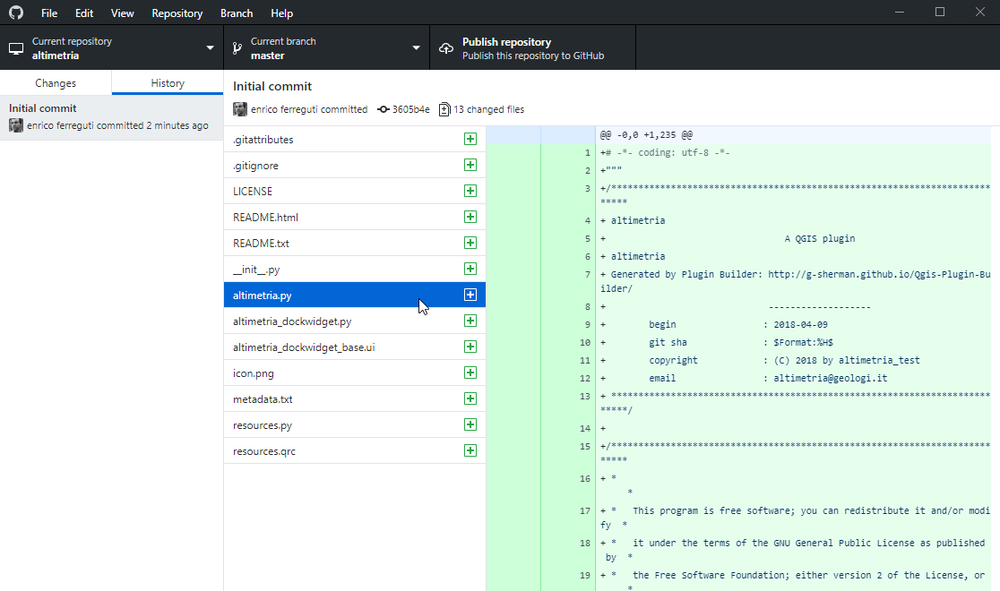

--

# MODULI e librerie

Un fattore determinante nel successo di Python è la flessibilità, la modularità e la facile estendibilità permessa dall'organizzazione del codice eseguibile in moduli.  

I moduli possono essere:

* predefiniti, già compresi nella [dotazione di base del linguaggio](https://docs.python.org/3/library/index.html)
* esterni, contenuti nei path di sistema di Python (PATH, PYTHONPATH). Possono essere preimportati o [importati da internet](https://pypi.python.org/pypi?%3Aaction=browse) tramite pip/setuptools
* definiti localmente dall'utente in altri files python

---

## Importazione dei moduli

I moduli sono collezioni strutturate ed organizzate di codice python le cui definizioni possono essere importate all'interno di un programma

```python
# Importa un modulo con chiamata ad una funzione contenuta
import math
math.floor(10.6)

# Importa singoli elementi da un modulo
from os import path
path.join('C:', 'Utenti', 'paolo', 'documenti')
'C:/Utenti/paolo/documenti'
```

--

## Organizzazione dei moduli

Quando importiamo un modulo, Python deve trovare il file corrispondente, e per farlo controlla in ordine le directory elencate nella lista `sys.path`. Una volta trovato il file, Python lo importa, crea un *module object* (oggetto modulo), e lo salva nel dizionario `sys.modules`. Se il modulo viene importato nuovamente in un altro punto del programma, Python è in grado di recuperare il modulo da `sys.modules` senza doverlo importare nuovamente. Inoltre, i moduli `.py` vengono *compilati in bytecode*: un formato più efficiente che viene salvato in file con estensione `.pyc` che a loro volta vengono salvati in una cartella chiamata `__pycache__`. Quando viene eseguito un programma che ha bisogno di importare un modulo, se `modulo.pyc` esiste già ed è aggiornato, allora Python importerà quello invece di ricompilare il modulo in bytecode ogni volta.

--

## La libreria standard di Python

Python 3 nella sua versione base già mette a disposizione un set molto ampio di moduli standard sviluppati sotto l'ombrello della comunità di Python: https://docs.python.org/3/library/

Alcuni dei moduli comunemente usati sono i seguenti:

operazioni matematiche: `math`

servizi generici del sistema operativo: `os` `shutil`

interfaccia runtime con il sistema: `sys` `io `

tipi estesi di dato: `time` `datetime` `collections`

protocolli internet e serializzazione: `urllib `  `httplib `  `json`

archiviazione di dati: `csv` `zipfile`

interfaccia utente: `argparse` `tkinter`

--

## `math`

https://docs.python.org/3/library/math.html

```
import math

math.floor(10.6) # troncamento al numero intero inferiore 
math.ceil(10.6) # troncamento al numero intero superiore 

math.pi # PI greco
math.cos(2*math.pi)
math.degrees(math.pi)

math.isclose(math.sin(0),0) #confronta numeri decimali con approssimazione
```

--

## `os` e `os.path`

https://docs.python.org/3/library/os.path.html#os.path.split

```
import os

path = os.path.join("c:/","OSGeo4W64","OSGeo4W.bat")
path = os.path.dirname(__file__)
dirpath = os.path.dirname(path)
os.path.split(path) separa il nome della directory dal file
os.path.splitext(path) separa il file (path completo) dall'estensione

os.remove(path) #cancella il file puntato da path
os.listdir(dirpath) #lista il contenuto di una directory 
os.makedirs(path) #crea il path completo
```

--

## Uso dei moduli esterni

E' possibile usare moduli esterni configurando opportunamente la variabile d'ambiente PYTHONPATH in modo che essa punti ad una cartella contente il codice del modulo

Oppure si può depositare manualmente la cartella contente il modulo python ed i moduli da esso dipendenti dentro la cartella "site-packages".

La comunità Python ha organizzato un repository dei moduli correntemente utilizzabili da python: https://pypi.python.org/pypi Il repository è utilizzabile tramite il comando [pip](https://pip.pypa.io/en/stable/installing/) installabile scaricando ed eseguendo il file [get-pip.py](http://pip.readthedocs.io/en/stable/installing/#do-i-need-to-install-pip)

```shell
python get-pip.py #se non già installato con python
pip install [nome pacchetto]
```

Il comando provvede ad installare il pacchetto desiderato insieme alle sue dipendenze nella versione stabilita dai *"requirements"* del modulo, aiutando il programmatore a superare i conflitti tra versioni diverse dei pacchetti installati.

--

## pip install

```shell
C:\Users\enrico>pip install requests
Collecting requests
...
Collecting idna<3,>=2.5 (from requests)
...
Collecting certifi>=2017.4.17 (from requests)
...
Collecting urllib3!=1.25.0,!=1.25.1,<1.26,>=1.21.1 (from requests)
...
Collecting chardet<4,>=3.0.2 (from requests)
...
Installing collected packages: idna, certifi, urllib3, chardet, requests
Successfully installed certifi-2019.11.28 chardet-3.0.4 idna-2.9 requests-2.23.0 urllib3-1.25.8
```

--

## altri comandi di pip

```
pip uninstall requests  #disinstallazione pacchetto

pip search requests     #ricerca pacchetto per nome

pip show requests       #mostra dettaglio di un pacchetto

pip list                #lista dei pacchetti installati

pip freeze              #genera in file requirements
```

--

## Virtualenv

I Virtualenv (ambienti virtuali) sono un modo semplice per  creare progetti Python isolati, in cui installare diverse librerie che  non andranno in conflitto con altre librerie in altri ambienti. 

Per installare virtualenv sulla proprima macchina, basta digitare su un terminale il comando

```shell
pip install virtualenv
```

A questo punto, si può creare l’ambiente virtuale, utilizzando il comando

```shell
cd <directory di progetto>
virtualenv <nome ambiente virtuale> #l'ambiente verrà creato nella directory corrente
```

--

Attivazione e deattivazione di un virtualenv

```
<path alla directory dell'ambiente virtuale>\scripts\activate.bat #per l'attivazione
deactivate #per la disattivazione
```

--

## Virtualenv wrapper

Uno strumento pratico per gestire gli ambienti virtuali è virtualenvwrapper: https://virtualenvwrapper.readthedocs.io/en/latest/ che permette di individuare un repository comune e permette di gestire la creazione.

vitualenvwrapper funziona nativamente con la shell di Linux e MacOS ma esiste una versione specifica per windows: https://pypi.org/project/virtualenvwrapper-win/

## Pipenv

https://pipenv.kennethreitz.org/en/latest/

E' un comando che unifica pip virtualenv e pipfile rendendo possibile la creazione al volo di ambienti di lavoro virtuali e gestendo al contempo le dipendenze ed il loro aggiornamento

--

## Anaconda

Anaconda è un sistema di gestione dei pacchetti esterni **alternativo a pip** e si configura come un vero e proprio ambiente operativo che comprende una propria versione di python ed un proprio gestore di ambienti virtuali.

Anaconda è particolarmente adatto per l'installazione di moduli che in pip prevedono la compilazione del codice dal lato utente e quindi per la gestione di moduli esterni in windows dove i requisiti per la compilazione spesso non sono soddisfatti e nei contesti scientifici dove è necessaria la performance e/o la possibilità di utilizzare librerie precompilati, magari in un altro linguaggio.

Anaconda può essere installato da quasta pagina: https://docs.conda.io/projects/conda/en/latest/user-guide/install/windows.html

```shell
conda install <package>
conda uninstall <package>
conda search
conda list
```

---

# MODULI ESTERNI

---

## Jupyter notebooks: 

[https://jupyter.org/](https://jupyter.org/)

E' un sistema per lo sviluppo e la generazione di "notebook" in Ipython, dei fogli di appunti autocommentati ed interattivi programmabili in Python.  E' ormai uno standard nel mondo scientifico per la presentanzione e la documentazione scientifica ed è uno strumento utilissimo per la formazione perchè consente di verificare passo passo i risultati di blocchi di codice.

Ma per capire cos'è Jupyter notebooks e cosa ci si può fare è utile dare un'occhiata a qualche repository di notebooks per esaminare l'ambiente operativo in cui ci troveremo a lavorare, per esempio l'ottimo Earthpy dedicato alle geoscience: http://earthpy.org/

--

## Installazione di Jupyter Notebooks

[https://jupyter.org/install](https://jupyter.org/install)

L'applicazione può essere installata sia con `pip` che con `anaconda`  ma, soprattutto se ci si trova in windows, la procedura è molto più semplice e senza complicazioni usando anaconda. Da riga di comando di anaconda possiamo digitare:

```shell
> conda install -c conda-forge notebook
```

una volta finita la procedura di installazione jupyter notebooks può essere attivato con il comando:

```
> jupyter notebook
```

--


--

## Jupyter. L'ambiente operativo

Una volta avviato con il comando `jupyter notebook` l'applicazione attiva un'interfaccia web per il dialogo con l'utente da cui si può sfogliare il contenuto del disco locale del computer per caricare files, programmi e notebook

I notebook jupyter possono essere registrati come files con estensione .ipynb e possono essere creati da zero cliccando sul pulsante **New** e poi su ***Notebook Python 3*** . Ci troviamo di fronte ad una finestra di esecuzione di comandi di python avviabili con il tasto **Run**


--

## Jupyter Notebooks in rete

I notebooks sono uno strumento potentissimo di comunicazione scientifica ed educativa.
Esistono in rete moltissimi repository di notebooks cho possono essere visualizzati o addirittura eseguiti su un server remoto (scarse performance e talvolta affollamento dei server) oppure scaricati localmente per essere eseguiti dalla sessione di jupyter notebook avviata sul nostro computer:

[Notebooks Generali dedicati alla programmazione python](https://github.com/jupyter/jupyter/wiki/A-gallery-of-interesting-Jupyter-Notebooks#general-python-programming)

altri notebooks più specifici possono essere eseguiti localmente installando i moduli necessari tramite conda

[Notebooks sulle geoscienze](https://github.com/jupyter/jupyter/wiki/A-gallery-of-interesting-Jupyter-Notebooks#earth-science-and-geo-spatial-data)

[Notebooks sulla manipolazione di dati](https://github.com/jupyter/jupyter/wiki/A-gallery-of-interesting-Jupyter-Notebooks#pandas-for-data-analysis)

[Notebooks su grafici e comunicazione di risultati](https://github.com/jupyter/jupyter/wiki/A-gallery-of-interesting-Jupyter-Notebooks#data-visualization-and-plotting)

[Notebooks su Statistica, machine learning, etc](https://github.com/jupyter/jupyter/wiki/A-gallery-of-interesting-Jupyter-Notebooks#statistics-machine-learning-and-data-science)

--

## Esercitazione: tabelline con Jupyter Notebook

Attivare notebook, iniziare un nuovo progetto e salvarlo con nome

riga1: definire la struttura dati che contiene i calcoli

```
tab = []
for num_c in range (1,11):
    row = []
    for num_r in range (1,11):
        row.append(num_c*num_r)
    tab.append(row)
```

riga2: output in html

```
output = "<table>"
for riga in tab:
    output += "<tr>"
    for col in riga:
        output += "<td>%d</td>" % col
    output += "</tr>"
output += "</table>"
```

riga3: formattiamo l'output

```
from IPython.display import display_html
display_html(output,raw=True)
```

ulteriori elaborazioni:  stampiamo con titoli in grassetto ed in markdown

[notebook finale](py/tables_nb.ipynb)


---

## Requests:  *http for humans*

https://requests.readthedocs.io/projects/it/it/latest/

Il modulo requests permette facili connessioni ad internet con il [protocollo http](https://it.wikipedia.org/wiki/Hypertext_Transfer_Protocol)

> Il modulo urllib2 della libreria standard Python mette a disposizione quasi tutte le principali funzionalità HTTP ma la sua interfaccia è molto frastagliata. Quel modulo è stato creato per tempi diversi - e un web diverso. Serve molto lavoro (addirittura anche l’overriding di metodi) per realizzare il più semplice dei task.

installazione

```
pip install requests
```

```
conda install requests
```

--

## Http - GET e POST

```
import requests
risposta = requests.get('https://api.github.com/events')
if risposta.status_code == 200:
	print (risposta.text) #output in formato text
	print (risposta.encoding) #codifica dell'output	
```

```
parametri =  {'chiave1': 'valore1', 'chiave2': 'valore2'}
risposta = requests.get("http://httpbin.org/get", params=parametri)
print (risposta.url)
print (risposta.text) #output in formato text		
```

```
payload =  {'key1': 'value1', 'key2': 'value2'}
risposta = requests.post("http://httpbin.org/post", data=payload )
print (risposta.url)
print (risposta.text) #output in formato text
```

--

## Esercitazione elaboriamo in python informazioni da wikipedia

Wikipedia possiede un'interfaccia di programmazione (API, *Application Programming Interface*) che permette di interfacciarsi con gli aspetti operativi del sito web: https://www.mediawiki.org/wiki/API:Main_page/it

Fra le altre cose è possibile effettuare [query ](https://www.mediawiki.org/wiki/API:Lists) sui contenuti con un'url simile a questa:

http://it.wikipedia.org/w/api.php?action=query&format=json&list=search&srsearch=python

quindi scriviamo un jupyter notebook per lo scaricamento e l'elaborazione di dati scaricati da wikipedia usando il modulo requests per la connessione e l'interrogazione ed il modulo json per la decodifica

---

## pandas 

https://pandas.pydata.org/docs/reference/index.html

Pandas è un modulo per l' importazione e la manipolazione di dati tabellari molto utilizzato nell'analisi dei dati e per lo "scraping" di dati da fonti diverse

https://www.datacamp.com/community/tutorials/pandas-tutorial-dataframe-python

## geopandas

https://geopandas.org/

Geopandas è un'estensione di pandas per associare ai dati tabellari un campo geometrico. Si possono inoltre gestire operazioni sulle geometrie (predicati geospaziali ed operazioni topologiche) e produrre grafici tematici in output.

https://raw.githubusercontent.com/jorisvandenbossche/geopandas-tutorial/master/01-introduction-geospatial-data.ipynb

---

# Esercitazione: analizziamo i dati aggiornati del coronavirus:

1) installazione di anaconda: https://docs.conda.io/en/latest/miniconda.html

2) installazione delle librerie necessarie:

```shell
> conda install requests pandas geopandas descartes
> conda install -c conda-forge jupyterlab
```

3) esecuzione jupiter notebook ed aggiornamento dei dati

```shell
> jupyter notebook
```

--

## Analisi dati covid19 delle provincie italiane

i dati grezzi sono scaricati dai seguenti repository:

- dati aggiornati sull'infezione dal repository della protezione civile: https://github.com/pcm-dpc/COVID-19
- dati geografici sui confini amministrativi dal repository di openpolis: https://github.com/openpolis

### Importazione dei dati sull'infezione in un dataframe pandas

```
import pandas
from datetime import datetime, timedelta

cv_df = pandas.read_csv("https://raw.githubusercontent.com/pcm-dpc/COVID-19/master/dati-province/dpc-covid19-ita-province.csv",parse_dates=['data'])
latest = cv_df['data'].max()
first = cv_df['data'].min()
before_latest = latest - timedelta(days=1)
print (first,latest,before_latest)
cv_df
```

--

### Filtro dei risultati per campo regione e per l'ultimo giorno di aggiornamento

```
from datetime import datetime
regione = "Piemonte"
cv_df_target = cv_df.loc[cv_df["data"]==latest]
cv_df_target = cv_df_target.loc[cv_df_target["denominazione_regione"] == regione]
cv_df_target.head()
```

### Generazione di un grafico a barre dei dati aggiornati

```
import matplotlib

ax = cv_df_target.plot.bar(x='denominazione_provincia', y='totale_casi', figsize=(16, 7))
ax.set_title(str(latest) + ' - casi in terapia intensiva')
```


--

### Importazione dei limiti amministrativi delle provincie italiane in un dataframe geopandas

```
import geopandas

geo_df = geopandas.read_file("https://raw.githubusercontent.com/openpolis/geojson-italy/master/geojson/limits_IT_provinces.geojson")
geo_df.crs = "EPSG:4326"
geo_df.head()
```

### Merge dei dati precedentemente processati

```python
cv_df_geo = geo_df.merge(cv_df_target, left_on='prov_acr', right_on='sigla_provincia')
cv_df_geo.head()
```


--

## Visualizzazione di una carta tematica

```python
import descartes

cv_df_geo.plot(column="totale_casi", cmap='OrRd', edgecolor = "lightgrey", linewidth = 0.5, figsize=(18, 8))
```

## Generazione di un grafico della progressione temportale dei casi

```
cv_pro1 = "Torino"
cv_df_progress1 = cv_df.loc[cv_df["denominazione_provincia"]==cv_pro1]

cv_pro2 = "Padova"
cv_df_progress2 = cv_df.loc[cv_df["denominazione_provincia"]==cv_pro2]
cv_df_progress2.head()
```

```
ax = cv_df_progress1.plot(x='data', y='totale_casi', figsize=(16, 7))
ax = cv_df_progress2.plot(ax = ax, x='data', y='totale_casi', figsize=(16, 7))
ax.set_title('%s e %s - totale casi' % (cv_pro1,cv_pro2))
ax.legend((cv_pro1, cv_pro2))
```

[Notebook finale](py/COVID19_datiPC.ipynb)

---

# COLLABORARE ALLO SVILUPPO DEL SOFTWARE OPEN SOURCE

--

## La piattaforma github

[Github](https://github.com/) (*Ghi-tab* per i non italiani) è una piattaforma web che permette agli sviluppatori di conservare e pubblicare i codici sorgenti dei propri programmi, senza perdere traccia delle versioni del codice stesso. Nel contempo permette a gruppi di sviluppatori di lavorare simultaneamente sullo stesso progetto evitando conflitti.
E' basato su Git, il potente strumento di versionamento creato da Linus Torvarlds, il creatore di Linux, per gestire lo sviluppo collaborativo del sistema operativo open source.

- Git è uno strumento a linea di comando, la cui comprensione esula dagli obiettivi del corso. Per approfondimenti si può fare riferimento ad uno dei tanti tutorial presenti in internet: https://www.slideshare.net/stefanovalle/guida-git

- E' ottimizzato per tenere traccia delle modifiche di file testo a livello di riga (non va bene quindi per file binari o per file di testo con poche righe)

--

## Git

per facilitare l'interazione dell'utente, github mette a disposizione Github desktop (disponibile per MacOS e Windows), che permette di gestire con facilità i vari flussi di lavoro senza necessariamente conoscere Git. E' comunque importante comprendere i principi di funzionamento di Git:


--

## Lessico di git/github

- *repository*: archivio di files e directory gestito da git. può essere locale o remoto

- *commit*: insieme coordinato di modifiche che l'utente registra sul repository

- *branch*: uno stato del repository che viene memorizzato dall'utente separatamente da altri branch. Esistono dei branch di sistema (master, origin etc...) e dei branch utente

- *diff*: operazione che mette in evidenza le modifiche di riga tra branch

- *merge*: operazione che permette di fondere tra loro due branch (per esempio un branch di sviluppo nel branch master) mettendo in evidenza eventuali conflitti

- *clone*: operazioone di clonazione in locale di un repository remoto

- *push*: operazione con la quale si si conferisce (submit) un branch locale ad un repository remoto tenendo condo dei conflitti tra versioni

- *pull*: operazione con la quale si scarica in locale un repository remoto

- *pull request*: operazione con la quale un utente propone la modifica di un repository

--

## github desktop

E' fondamentalmente un'interfaccia grafica di Git integrata con il servizio di Github


--

## Esercitazione di Github

- accreditarsi su Github, scaricare ed installare Github desktop

- inizializzare un repository

- clonare un repository

- modificare i files / verificare le differenze / realizzare un commit

- creare un branch

- fondere (merge) due branch

- pubblicare un repository

- inviare una pull request (PR)
