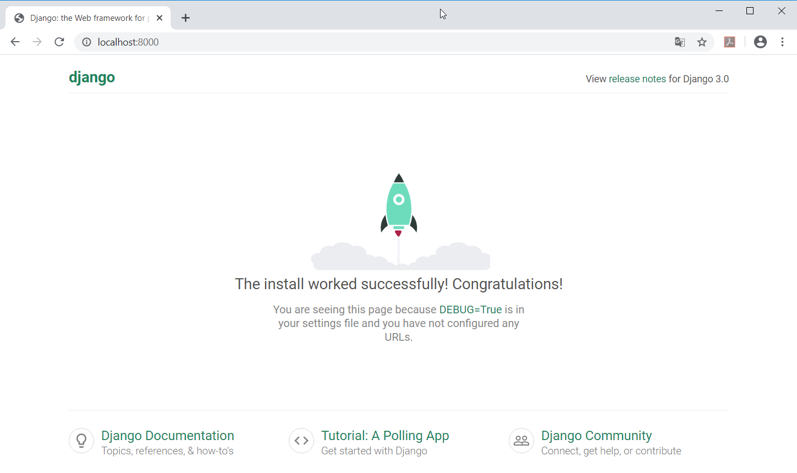
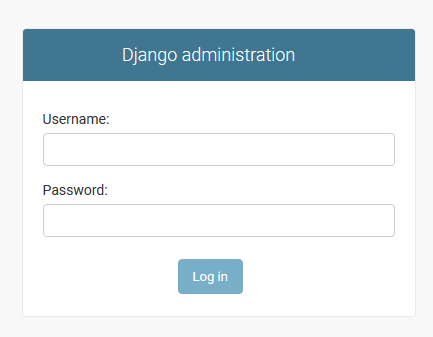
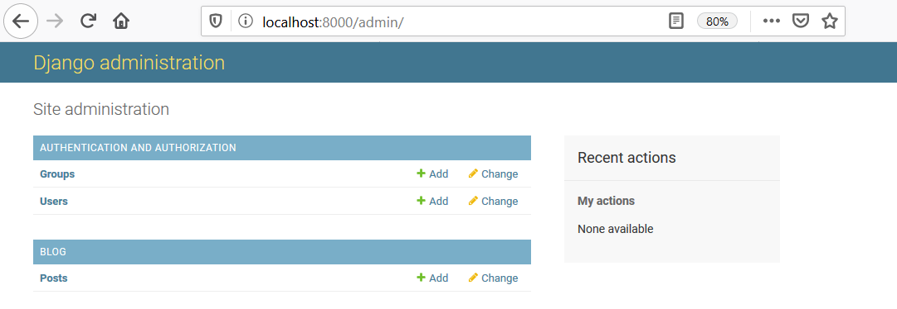
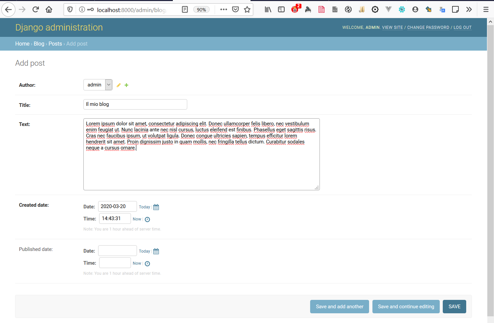
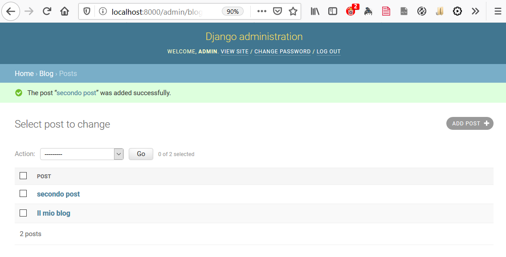

---

# SVILUPPARE UNA APPLICAZIONE WEB

- ARCHITETTURA CLIENT/SERVER
- PROTOCOLLO HTTP
- APPLICAZIONE WEB LATO SERVER
  - GESTISCE LE RICHIESTE CON RISPOSTE 
  - GESTISCE I LIVELLI DI ACCESSO ED AUTENTICAZIONE
  - SI RAPPORTA CON IL BACKEND
    - DATABASE
    - STRUTTURE ED ORGANIZZAZIONI DI DATI INTERNE
- PYTHON LATO SERVER
  - FLASK
  - PLONE
  - DJANGO

---

## DJANGO

**Django** è un [web framework](https://it.wikipedia.org/wiki/Web_framework) con licenza [open source](https://it.wikipedia.org/wiki/Open_source) per lo sviluppo di [applicazioni web](https://it.wikipedia.org/wiki/Applicazione_web), scritto in linguaggio [Python](https://it.wikipedia.org/wiki/Python), seguendo il paradigma "Model-Template-View".

Il progetto è sviluppato dalla "Django Software Foundation" (DSF), un'organizzazione indipendente senza scopo di lucro.[[1\]](https://it.wikipedia.org/wiki/Django_(informatica)#cite_note-1) Venne concepito inizialmente per gestire diversi siti di notizie per la World Company di [Lawrence (Kansas)](https://it.wikipedia.org/wiki/Lawrence_(Kansas)), e distribuito con una [licenza BSD](https://it.wikipedia.org/wiki/Licenza_BSD) a luglio [2005](https://it.wikipedia.org/wiki/2005).


--

###  Caratteristiche principali

- Possibilità di installare funzionalità attraverso moduli e webapp
- Gestore di URL basate su [espressioni regolari](https://it.wikipedia.org/wiki/Espressione_regolare).
- Astrazione del database relazionale ad oggetti. Robusta [API](https://it.wikipedia.org/wiki/Application_Programming_Interface) per la gestione del [database](https://it.wikipedia.org/wiki/Database).
- Sistema di "view generiche" che evitano la stesura di codice ripetitivo per determinati casi comuni. 
- Sistema di [template](https://it.wikipedia.org/wiki/Template) basato su [tag](https://it.wikipedia.org/wiki/Tag_(markup)) con [ereditarietà](https://it.wikipedia.org/wiki/Ereditarietà) dei template.
- Sistema "middleware" per lo sviluppo di funzionalità aggiuntive; 
- Interfaccia amministrativa programmabile ed estendibile
- Supporto per [localizzazione](https://it.wikipedia.org/wiki/Localizzazione_(software)) disponibile in molte lingue.
- Sistema di gestione degli utenti e loro autenticazione nell'applicazione Web.

---

## Django step by step

* Installazione e preparazione dell'ambiente
* installazione di django
* creare un'applicazione
* definire i modelli dei dati
* le query in django
* richieste e risposte Http con le view
* accedere con admin
* gestire le URL
* I templates in django
* le form in django

--

## Risorse

Documentazione: https://docs.djangoproject.com/en/3.0/

Tutorial Djangogirls: https://tutorial.djangogirls.org/it/

Tutorial Mozilla: https://developer.mozilla.org/it/docs/Learn/Server-side/Django


---

## Installazione e preparazione dell'ambiente

Django è un'applicazione fatta per essere fatta girare su server di rete aperti su internet, ma per finalità di sviluppo può essere installata localmente facendo funzionare il proprio PC come server di sviluppo (localhost) per sviluppare e testare il codice prima di copiare ed installare tutti i componenti della nostra applicazione web sul server remoto (deployment).  Per "facilitare" l'operazione anche per chi lavora su pc Windows usiamo Anaconda per creare e configurare l'ambiente virtuale ed installare i moduli python necessari.

Apriamo la console di anaconda per creare un'ambiente virtuale ed installare django (si può fare anche con pip e virtualenv)

```shell
conda create --name miosito
conda activate miosito
conda install django
```

---

## Creiamo un nuovo server Django

Creeremo un semplice Blog usando gli [esempi del tutorial di DjangoGirls](https://tutorial.djangogirls.org/it/) che sono concessi da [djangogirls.org](https://djangogirls.org/) con licenza [Creative Commons Attribution-ShareAlike 4.0](https://creativecommons.org/licenses/by-sa/4.0/)

Una volta installato il modulo django dovremo creare l'infrastruttura base della nostra applicazione web. Quello che gli sviluppatori chiamano *"boilerplate"* una parola intraducibile in italiano che sta a significare tutto un'armamentario di configurazioni e comandi iniziali necessari e da ripetere per ogni installazione. Questa operazione è possibile con un nuovo comando installato da django:

```
django-admin startproject mioblog .
```

NB. attenzione ad includere anche il puntino finale che sta a significare "la directory in cui ci troviamo ora" quindi prima di eseguire il comando dovremo creare una cartella adeguata (`mkdir <path nuova cartella>`) ed eseguire il comando da quel punto (`cd <path nuova cartella>`) 

--

### Struttura essenziale di un server django

Il comando installa una serie di files ed una sottocartella con il nome scelto per il nostro sito. In Windows Si può facilmente verificare usando il comando `tree /F`

```
C:.
│   manage.py
│
└───mioblog
        asgi.py
        settings.py
        urls.py
        wsgi.py
        __init__.py
```

`manage.py` è uno script personalizzato che aiuta a gestire il sito.  Usandolo saremo in grado di avviare un web server sul nostro computer  senza dover installare nient'altro, tra l'altro.

Il file `settings.py` contiene la configurazione del tuo sito web.

 il file `urls.py` contiene una lista di schemi usati da `urlresolver` per interpretare le URL richieste al nostro sito.

Gli altri files in questo momento non ci interessano ma sono essenziali per il deployment e l'esecuzione.

--

### Personalizziamo le impostazioni

Apriamo con un'editor il file settings.py per esaminare il contenuto e modificare ed aggiungere configurazioni personalizzate.

per esempio aggiustiamo la [time zone](https://en.wikipedia.org/wiki/List_of_tz_database_time_zones)

```python
TIME_ZONE = 'Europe/Rome'
```

e specifichiamo la cartella locale per i files statici necessari (javascript, fogli di stile css etc..)

```python
STATIC_URL = '/static/'
STATIC_ROOT = os.path.join(BASE_DIR, 'static')
```


--

### Configurazione del database

Ci sono un sacco di software di database diversi che possono immagazzinare dati per il tuo sito. Noi useremo quello di default, `sqlite3`, che va benissimo in fase di sviluppo o per siti semplici ma che invece va sostituito con un database multiutente più performante (postgresql per esempio) qualora volessimo utilizzare il nostro sito in produzione. SQLITE È già impostato in questa parte del file `mysite/settings.py`:

```python
DATABASES = {
    'default': {
        'ENGINE': 'django.db.backends.sqlite3',
        'NAME': os.path.join(BASE_DIR, 'db.sqlite3'),
    }
}
```

Dobbiamo però inizializzarlo creando il nostro personale database (nel caso di SQLLITE il database è contenuto in un file) eseguendo la "migrazione" iniziale tramite il comando manage.py

```
python manage.py migrate
```

Di fatto una "migrazione" è una successione di operazioni sul database (creazione di tabelle, creazione di campi, di indici e di chiavi primarie o modifiche di questi) necessarie per l'aggiornamento del database alla corrente organizzazione dei dati correntemente definita in django. Possiamo esaminare il database con https://sqlitebrowser.org/dl/


--

### Avviare il server django

I componenti base di un server django ci sono tutti e si può avviare il server eseguendo la direttiva runserver del comando manage.py:

```shell
python manage.py runserver
```

se tutto è a posto dovrebbe comparire una serie di messaggi che indicano che il server è attivo e funzionante sulla nostra macchina (localhost ovvero 127.0.0.1) e sulla porta di default 8000

```
Watching for file changes with StatReloader
Performing system checks...

System check identified no issues (0 silenced).
March 20, 2020 - 10:49:15
Django version 3.0.3, using settings 'mioblog.settings'
Starting development server at http://127.0.0.1:8000/
Quit the server with CTRL-BREAK.
```

--

Esaminiamo il server con un browser andando su: http://localhost:8000



e adesso è ora di creare un po' di contenuti....


---

## Creazione di un'applicazione di django

Per mantenere tutto ordinato, per ogni funzione del nostro sito creeremo un'applicazione diversa  all'interno del nostro progetto che ha una sua logica autonoma e può funzionare separatamente dalle altre parti del nostro sito. Per creare un'applicazione abbiamo bisogno di eseguire  il seguente comando nella console (dalla cartella dove si trova il file `manage.py`):

```shell
python manage.py startapp blog
```

Il comando genera il "boilerplate" della nuova applicazione web in nuova cartella `blog` con alcuni nuovi files:

```shell
├───blog
│   │   admin.py
│   │   apps.py
│   │   models.py
│   │   tests.py
│   │   views.py
│   │   __init__.py
│   │
│   └───migrations
│           __init__.py
```


--

### "Registriamo" la nostra nuova applicazione

Dopo aver creato un'applicazione dobbiamo dire a Django che dovrebbe utilizzarla. Lo facciamo nel file `mysite/settings.py`. Dobbiamo trovare `INSTALLED_APPS` ed aggiungere una riga che contenga `'blog',` appena sopra`]`. Quindi il prodotto finale dovrebbe assomigliare a questo:

```python
INSTALLED_APPS = [
    'django.contrib.admin',
    'django.contrib.auth',
    'django.contrib.contenttypes',
    'django.contrib.sessions',
    'django.contrib.messages',
    'django.contrib.staticfiles',
    'blog',
]
```


--

### Creazione di un modello blog post

Nel file `blog/models.py` definiamo tutti gli oggetti chiamati `Models` - Questo è il posto dove definiremo il nostro blog post.

Un modello in Django è uno speciale tipo di oggetto che si interfaccia con il database SQL che usiamo come *backend*  per memorizzare i nostri dati e che ci permette di lavorare con essi (creazione, modifica, cancellazione ricerca) astraendoci da esso in modo indipendente dalla logica sottostante (query sql)

Abbiamo già definito in setting.py l'adattore predefinito al database SQLITE su cui i nostri dati saranno scritti e letti.

Modelli in django: https://docs.djangoproject.com/en/3.0/topics/db/models/


--

### Definizione del modello di dati Django

Apriamo `blog/models.py`, e sostituiamo il codice esistente con il seguente:

```python
from django.db import models
from django.utils import timezone

class Post(models.Model):
    author = models.ForeignKey('auth.User', on_delete=models.CASCADE)
    title = models.CharField(max_length=200)
    text = models.TextField()
    created_date = models.DateTimeField(default=timezone.now)
    published_date = models.DateTimeField(blank=True, null=True)

    def publish(self):
        self.published_date = timezone.now()
        self.save()

    def __str__(self):
        return self.title
```

Attenzione due caratteri di sottolineatura (`_`) su ciascun lato di `str`.  E' un metodo speciale di [Python](https://www.html.it/pag/69772/metodi-speciali/)....


--

### Applichiamo le modifiche al nostro database

A questo punto dobbiamo aggiungere un nuovo modello al nostro  database. Prima dobbiamo far sapere a Django che ci sono alcuni cambiamentidovuti alla creazione di un nuovo modello. Digita `python manage.py makemigrations blog`.  Dovremmo ottenere un messaggio tipo questo:

```
Migrations for 'blog':
  0001_initial.py:
  - Create model Post
```

Django ha preparato un file di migrazione che adesso dobbiamo applicare nel nostro database con `python manage.py migrate blog` e l'output dovrebbe essere:

```
Operations to perform:
  Apply all migrations: blog
Running migrations:
  Rendering model states... DONE
  Applying blog.0001_initial... OK
```

Ora Il nostro modello Post ora è nel database!  


---

## L'interfaccia di amministrazione di Django

Per aggiungere, modificare e cancellare i post che abbiamo appena strutturato useremo Django admin.

Apriamo il file `blog/admin.py` e sostituiamo il suo contenuto con:

```
from django.contrib import admin
from .models import Post

admin.site.register(Post)
```

Dobbiamo configurare l'applicazione in modo che il modello di Post che abbiamo definito nel capitolo precedente sia visibile nella pagina di admin con `admin.site.register(Post)`.

OK, è tempo di guardare il nostro modello Post. Ricordiamoci di eseguire `python manage.py runserver` nella console per avviare il web server. Vai nel browser e scrivi l'indirizzo http://127.0.0.1:8000/admin/ Vedrai una pagina di login come questa:




--

### Creazione del *superuser*

Per accedere, bisogna prima creare un *superuser* - un utente che ha il controllo su tutto nel sito. Torniamo alla command-line e digitiamo `python manage.py createsuperuser`, e premi invio. Quando richiesto, digita il tuo username (minuscole,  senza spazi), indirizzo e-mail e password. La password è un dato sensibile e non verrà visualizzata durante la digitazione. 

Nel file settings.py c'è una sezione dedicata alla validazione del testo della passwords (`AUTH_PASSWORD_VALIDATORS = [...]`) che ci obbliga ad una password di una certa complessità: almeno 8 caratteri alfanumerici differenti dal nome dell'utente...

Il risultato sarà il seguente:

```shell
python manage.py createsuperuser
Username: admin
Email address: admin@admin.com
Password:
Password (again):
Superuser created successfully.
```


--

### Login Amministrativo:

Una volta loggati con le credenziali appena inserite apparirà la schermata amministrativa iniziale con i link ai modelli di sistema (utenti e gruppi) ed al modello post che abbiamo appena creato.



--

### Inserimento di un post




--

### Vista degli oggetti inseriti



---

## Django URL

Dopo che abbiamo inserito i nostri post li vogliamo mostrare su internet ai visitatori del nostro sito senza la necessità di accedere all'interfaccia amministrativa e con la grafica che più ci piace. Ma prima dobbiamo gestire le richieste dei visitatori (urls) ed inoltrarle ad opportune procedure che gestiscono le risposte (views)

#### Che cos'è un URL?

Una URL è semplicemente un indirizzo web. Puoi vedere una URL ogni  volta che visiti un sito web - si vede nella barra degli indirizzi del  tuo browser. (sì! `127.0.0.1:8000` is a URL! Anche `https://djangogirls.org` è una URL):

Ogni pagina internet ha bisogno della sua URL. In questo modo la tua  applicazione sa cosa deve mostrare a un utente che visita una URL. In  Django usiamo qualcosa chiamato `URLconf` ( configurazione  dell'URL). URLconf è un insieme di modelli che Django cercherà di far  corrispondere con l'URL ricevuta per trovare la view giusta.


--

## Come funzionano le URL in Django?

Apriamo il file `miosito2/urls.py` nel code editor e vediamo com'è:

```python
"""mioblog URL Configuration

The `urlpatterns` list routes URLs to views. For more information please see:
    https://docs.djangoproject.com/en/3.0/topics/http/urls/
Examples:
Function views
    1. Add an import:  from my_app import views
    2. Add a URL to urlpatterns:  path('', views.home, name='home')
Class-based views
    1. Add an import:  from other_app.views import Home
    2. Add a URL to urlpatterns:  path('', Home.as_view(), name='home')
Including another URLconf
    1. Import the include() function: from django.urls import include, path
    2. Add a URL to urlpatterns:  path('blog/', include('blog.urls'))
"""
from django.contrib import admin
from django.urls import path

urlpatterns = [
    path('admin/', admin.site.urls),
]
```


--

## Inseriamo una nostra URL

possiamo includere una nuova url inserendo una riga nella lista degli urlpatterns, rimandando la sua definizione allo specifico file urls.py presente all'interno della nostra applicazione blog

```
urlpatterns = [
    path('admin/', admin.site.urls),
    path('blog/', include('blog.urls') )
]
```

ora dovremo andare a definire il file `blog/urls.py` e specificare come gestire le url relative a questa applicazione importando opportunamente la funzione include. Con un editor creiamo il file e inseriamo il seguente testo:

```python
from django.urls import path
from . import views

urlpatterns = [
    path('', views.post_list),
]
```

Con `from . import views` dalla directory in cui è localizzato il file `urls.py` andiamo ad importare il modulo `views.py`. In esso , per gestire l'url sarà necessario implementare una funzione `post_list` in grado si soddisfare la richiesta http.


---

## Le Views di django

Ovviamente perchè la nostra applicazione possa funzionare bisogna completare la logica di funzionamento implementando la funzione nel modulo views. Infatti il server non è in funzione a causa di un errore (dalla console):

```
AttributeError: module 'blog.views' has no attribute 'post_list'
```

apriamo il file blog/views.py ed andiamo a definire la funzione post_list usando l'oggetto HttpResponse

```python
from django.http import HttpResponse

def post_list(request):
    response = HttpResponse("Ciao Mondo dal mio server django")
    return response
```

A questo punto l'errore della console sparirà, e collegandosi a "http://localhost/blog/" comparirà sullo schermo del browser la stringa che abbiamo usato per la risposta. Il risultato è per ora un po' scarno ma abbiamo stabilito una relazione tra il nostro server ed il mondo. Andiamo ora ad interrogare il database per restituire una lista dei post


---

## Queryset

I post inseriti risiedono nel database come oggetti del modello Post. Si tratta a questo punto di andarli a recuperare per mezzo di un Queryset. Ovvero una lista di oggetti di un database che possiamo ordinare o filtrare. Possiamo esercitarci sull'utilizzo dei Queryset usando la shell del nostro progetto di django:

```
python manage.py shell
```

Ci apparirà una shell di python riconoscibile dal classico pronto ">>>" che ci permetterà di interagire con gli oggetti che abbiamo fin qui creato. Andiamo ad importare ed esaminare in modello `Post`

```python
from blog.models import Post
```

```
Post.objects.all()
```

Ci apparirà il queryset del modello Post relativo a tutti gli oggetti inseriti:

```
<QuerySet [<Post: Il mio blog>, <Post: secondo post>]>
```


--

### Creare nuovi oggetti

Così si crea un nuovo oggetto Post nel database:

```
>>> Post.objects.create(author=me, title='Titolo di esempio', text='Testo di esempio')
```

Ma manca un ingrediente: `me`. Dobbiamo passare un'istanza del modello `User` come un autore Importando il modello User ed andando a selezionare l'oggetto corrispondente al nostro User :

```python
>>> from django.contrib.auth.models import User
```

```python
>>> User.objects.all()
<QuerySet [<User: admin>]>
>>> User._meta.get_fields
(..., <django.db.models.fields.CharField: username>, ....)
```

Fin qui l'unico utente inserito è il superuser `admin` quindi non ci basta che selezionare lo username con il metodo get:

```
me = User.objects.get(username='admin')
```

ora quindi possiamo inserire un nuovo Post:

```
Post.objects.create(author=me, title='Un altro post', text='contenuto del mio nuovo post')
```


--

### Filtrare gli oggeti

Larga parte parte dei QuerySet consiste nell'abilità di filtrarli.  Diciamo che vogliamo trovare tutti i post che hanno come autore l'Utente ola. Useremo `filter` invece di `all` in `Post.objects.all()`. Tra parentesi affermeremo le condizioni che un blog post deve  soddisfare per finire nel nostro queryset. Nella nostra situazione è `autore` che è uguale a `me`. Il modo di scriverlo in Django è `autore=me`. Ora il nostro pezzo di codice ha questo aspetto:

```
>>> Post.objects.filter(author=me)
<QuerySet [<Post: Il mio blog>, <Post: secondo post>, <Post: Un altro post>]>
```

O magari vogliamo vedere tutti i post che contengono la parola 'post' nel campo title?

```
>>> Post.objects.filter(title__contains='post')
<QuerySet [<Post: Sample title>, <Post: 4th title of post>]>
```

> **Nota** ci sono due caratteri di sottolineatura (`_`) tra `titolo` e `contains`. L'ORM di Django usa questa sintassi per separare i nomi dei campi  ("titolo") ed operazioni o filtri ("contiene"). Se si usa solo un carattere di sottolineatura, si otterrà un errore come "FieldError: non è possibile risolvere la parola chiave title_contains".


--

### Ordinare gli oggetti

I QuerySet permettono anche di ordinare le liste di oggetti. Proviamo a ordinarli in base al campo `created_date`:

```
>>> Post.objects.order_by('title')
<QuerySet [<Post: Il mio blog>, <Post: Un altro POST>, <Post: secondo post>]>
```

Possiamo anche invertire l'ordine aggiungendo `-` all'inizio:

```
>>> Post.objects.order_by('-created_date')
<QuerySet [<Post: Un altro POST>, <Post: secondo post>, <Post: Il mio blog>]>
```

### QuerySet di concatenamento

Puoi anche combinare QuerySet  **concatenandole** insieme:

```
>>> Post.objects.filter(published_date__lte=timezone.now()).order_by('published_date')
```

possiamo ora completare la nostra risposta restituendo in modo opportuno la nostra lista di oggetti Post


--

### Elenco Post in View

```
from django.http import HttpResponse
from .models import Post

def post_list(request):
    post_inseriti = Post.objects.all()
    response = HttpResponse("Ciao Mondo dal mio server django")
    for post in post_inseriti:
        response.write(post.title)
        response.write(post.text)
    return response
```

il risultato non è ancora quello che ci aspettiamo da un blog, ma ci stiamo avvicinando. Dobbiamo generare una risposta Html perchè il risultato risulti leggibile e ben formato. Si potrebbe generare inserendo degli opportuni tag html inframmezzati dal contenuto ma questo metodo legherebbe troppo il risultato finale alla logica di programmazione. In django si può tenere tutto separato usando i templates


---

## Template engine

Un template è una pagina html con inframmezzati alcuni **template tags** che servono per interagire con il motore dei templates di django. Andiamo a creare un nuovo template nella cartella `blog/templates/blog/post_list.html` andando a creare le cartelle mancanti qualora non fossero ancora state generate.

```django
<html>
    <head><title>{{ blog_title }}</title></head>
    <body>
        <h1>{{ blog_title }}</h1>
        
            <h2>{{ post.title }}</h2>
            <p>{{ post.text }}</p>
            <small>creato da {{post.author.username }} il {{ post.created_date}}</small>
        
    </body>
</html>
```

Vediamo come dentro il codice html abbiamo inserito alcuni contenuti speciali racchiusi da doppie parentesi graffe `{{ blog_title }}` che rappresentano contenuti di dati ed altri racchiusi da parantesi graffe e percentuali `` che rappresentano delle direttive.


--

### Uso dei templates nelle view

Possiamo ora andare a modificare il codice della funzione post_list per generare il template che abbiamo appena scritto usando l'oggetto `render`:

```python
from django.shortcuts import render
from .models import Post

def post_list(request):
    post_inseriti = Post.objects.all()
    parametri = {
    	"blog_title": "Il mio blog in Django",
    	"posts": post_inseriti
    }
    return render(request,"post_list.html", parametri)
```

Abbiamo quindi compreso come gestire i dati grezzi memorizzati sul server e lasciare al template engine la loro stilizzazione finale dinamica separando il contenuto dalla visualizzazione. Magari per ingentilire un po' la visualizzazione possiamo importare [bootstrap](https://getbootstrap.com/), uno dei più popolari framework HTML e CSS per costruire bellissimi siti internet, includendo nella sezione head i link alle librerie css predefinite

```
<link rel="stylesheet" href="https://stackpath.bootstrapcdn.com/bootstrap/4.4.1/css/bootstrap.min.css">
```


--

### File statici in Django

Infine, daremo uno sguardo più approfondito a quelli che abbiamo chiamato **file statici**. I file statici sono tutti i tuoi CSS e le immagini -- file che non sono dinamici, il loro contenuto non dipende dal contesto della richiesta e  sarà lo stesso per ogni utente.

#### Dove mettere i file statici in Django

Nel caso dobbiamo includere dei files statici validi per tutto il progetto dovremo posizionarli dentro la cartella `static` definita nel file settings.py. Se invece dobbiamo definire i files statici  per la nostra  app, `blog` andremo a creare una cartella denominata `static` all'interno della nostra app blog:

```
djangogirls
├── blog
│   ├── migrations
│   ├── static
│   └── templates
├── mysite
└── static
```

Django troverà automaticamente tutte le cartelle  chiamate "static" dentro le cartelle delle tua app, e sarà in grado di  utilizzare il loro contenuto come file statici.


--

### Definire un CSS personalizzato

Ora, creiamo un file CSS, per poter aggiungere il tuo stile personale al tuo sito. Crea una nuova cartella dal nome `css` all'interno della tua cartella `static`. Poi, crea un nuovo file all'interno della tua cartella `css` e chiamalo `blog.css`. Fatto?

```
djangogirls
└─── blog
     └─── static
          └─── css
               └─── blog.css
```

Aggiungi il seguente codice nel tuo file `static/css/blog.css`:

```css
h1 {
    color: red;
}

h2 {
    color: green;
}

small {
	color: gray;
}
```

Per saperne di più: [CSS Selectors in w3schools](http://www.w3schools.com/cssref/css_selectors.asp).

--

### Files statici e templates

Infine, dobbiamo anche far sapere al nostro template in HTML che abbiamo effettivamente aggiunto un po' di CSS. Apriamo il file `blog/templates/blog/post_list.html` e aggiungiamo la seguente riga di testo:


```

```


Per ora stiamo solamente caricando tutti i nostri static files :). Aggiungiamo questa riga nell'heading, subito dopo il link al file CSS di Bootstrap (il browser legge i file  nell'ordine in cui sono dati, in questo modo il codice nei nostri files può  sovrascrivere il codice presente nei files di Bootstrap):

```django
<link rel="stylesheet" href="">
```

Stiamo dicendo al nostro template dove trovare i nostri file CSS.


---

## Estendere l'applicazione con altre view

Adesso immaginiamo di voler estendere il nostro blog aggiungendo una nuova pagina con i dettagli di un post. Per fare questo dovremo fare tre cose: 

- aggiungere un URL in blog/urls.py
- Implementare una nuova view per gestire la richiesta di una pagina di dettaglio
- aggiungere un nuovo template per la pagina di dettaglio

#### Aggiungere una URL per la pagina di dettaglio

aggiungiamo ad `urlpatterns` in `blog/urls.py` la seguente riga:

```
path("<int:id>/", views.post_detail, name="post_detail"),
```

E notiamo la stringa `"<int:id>/"` che significa che sarà lecito effettuare una richiesta http contenente un numero intero con l'id del post prima dello slash finale, che sarà inoltrato come parametro id alla funzione view di dettaglio che andremo ad implementare. Quindi nel caso del nostro server locale sarà possibile richiedere: http://localhost/blog/1/ tenendo presente che il numero dovrà corrispondere al'id primario del post.


--

### Una view per una pagina di dettaglio

Anche se non definita ogni modello possiede un campo chiave primaria associato ad ogni riga del database. In Django questo campo univoco e definito di default si chiama `pk` (primary key). 

La nuova funzione view di dettaglio otterrà come parametro id il numero richiesto di chiave primaria ed effettuerà una query sul modello post per estrarre l'oggetto desiderato:

```python
def post_detail(request,id=None):
	detail = Post.objects.get(pk=id)
    parameters = {
        "blog_title": "Il mio blog in Django" ,
        "post": detail
    }
	return render(request, "blog/post_detail.html", parameters)
```

Ovviamente dovremo realizzare un nuovo template per la rappresentazione del post di dettaglio ed includere un link alla pagina di dettaglio dalla lista dei post.


--

### Un template di dettaglio e link nel template lista

Prima di scrivere il template di dettaglio possiamo inserire un link nel template lista dei post in modo da avere un link diretto alla pagina di dettaglio direttamente dal blog. Modifichiamo la riga relativa titolo facendola diventare un link alla pagina di dettaglio e e creiamo un nuovo template:

```django
<a href="/blog/{{ post.pk }}/"><h2>{{ post.title }}</h2></a>
```

```django

<html>
    <head>
    	<link rel="stylesheet" href="">
    	<title>{{ blog_title }}</title>
    </head>
    <body>
        <h1>{{ post.title  }}</h1>
        <strong>{{ post.text }}</strong>
        <p>Autore {{post.author.username }}</p>
        <p>creato il {{ post.created_date}}</p>
        
        	<p>pubblicato il {{ post.publish_date}}, clicca per non pubblicarlo</p>
       	
        	<p>non ancora pubblicato, clicca per pubblicarlo</p>
        
    </body>
</html>
```


--

### Estendere i template di django

I due template condividono alcune parti del codice, per esempio l'header e sarebbe utile scrivere una sola volta tali parti e fare in modo che gli altri template possano riusarle. Per fare questo creiamo un nuovo template `blog_base.html` che contiene la definizione della pagina:

```django

<html>
    <head>
    	<link rel="stylesheet" href="">
    	<title>{{ blog_title }}</title>
    </head>
    <body>
		<h1>{{ blog_title }}</h1><hr/>
		
		
    </body>
</html>
```

ed andiamo a modificare `post_list.html` in modo da riusare il codice del template base:

```django


	
		<a href="/blog/{{ post.pk }}/"><h2>{{ post.title }}</h2></a>
		<p>{{ post.text }}</p>
		<small>creato da {{ post.author.username }} il {{ post.created_date }}</small>
	

```

e facciamo la stessa operazione per `post_detail.html`


---

## Form in Django

Infine vogliamo creare un bel modo per poter aggiungere e cambiare in nostri blog posts. Django `admin` è comodo e completo, ma è alquanto difficile da personalizzare. Con i `forms` potremo configurare con precisione l'aspetto della nostra pagina di inserimento.

In Django possiamo sia inventare un nuovo form da zero che creare un `ModelForm` che salverà il risultato del form sul nostro modello. Adesso andremo a fare una form per il nostro modello dei `Post` derivandola dal modello dei dati

Come ogni parte importante di Django, i forms devono essere definiti all'interno dell'applicazione blog nel file:` blog/forms.py`

```python
from django import forms

from .models import Post

class PostForm(forms.ModelForm):

    class Meta:
        model = Post
        fields = ('title', 'text', )
```


--

### Una URL ed una view per creare un nuovo post

Andiamo adesso a definire una nuova url per creare un post e aggiungiamo la a `blog/urls.py` :

```
    path('new/', view.post_new, name="post_new"),
```

in `blog/views.py` importiamo la Form ed andiamo ad aggiungere la view post_new  :

```python
from .forms import PostForm
```

```python
def post_new(request):
    form = PostForm()
    return render(request, 'blog/post_form.html', {'form': form})
```

Per creare un nuovo `Post` form, dobbiamo chiamare il metodo `PostForm()` e passarlo nel nostro template. Torneremo poi sulla *view*, ma per ora creiamo un veloce template per il nostro form.


--

### Form Template 

- dobbiamo rendere il form visibile. Per farlo possiamo usare semplicemente `{{ form.as_p }}`.
- le righe scritte sopra hanno bisogno di 'essere avvolte' da un HTML tag: `...`
- ci serve un `Save` pulsante. Possiamo fare ciò con HTML button: `Save`
- infine, subito dopo l'apertura del tag ``, dobbiamo aggiungere ` `. Questo passaggio è molto importante dal momento che rende il nostro  [form sicuro.](https://docs.djangoproject.com/en/3.0/ref/csrf/)

```django



    <h2>Nuovo Post</h2>
    <form method="POST">
        {{ form.as_p }}
        <button type="submit">Save</button>
    </form>

```

non ci resta che aggiungere un link in template base per aggiungere un nuovo post:


--

### Salvare il Form

Per rendere i cambiamenti persistenti scrivendo i contenuti inseriti nel database dobbiamo modificare la view per gestire l'invio dei dati.

Quando inviamo il form, veniamo riportati alla stessa view, ma questa volta abbiamo più dati in `request`, in particolare in `request.POST` (il nome non ha nulla a che vedere con un blog "post", bensì con il metodo http **[POST](https://en.wikipedia.org/wiki/POST_(HTTP))** che viene usato dalla form HTML per l'invio dei dati). Quindi a livello di view bisogna capire se stiamo ricevendo una connessione http **GET** ovvero quella usata per richiedere i dati ed in questo caso invieremo in risposta il form da compilare o POST, quella usata per inviare i dati ed in questo caso salveremo i dati ricevuti nel modello e mostreremo il post inserito. Andiamo a modificare di conseguenza la view `post_new`

```
def post_new(request):
	if request.POST:
		form = PostForm(request.POST)
		if form.is_valid():
			post = form.save(commit=False)
			post.author = request.user
			user = request.user
			post.save()
			return post_detail(request, id=post.pk)
	else:
		form = PostForm()
		return render(request, 'blog/post_form.html', {'form': form})
```


--

### Modificare un post

Potremmo modificare un post aggiungendo una view post_edit che prepapara il form con i dati del post indicato caricati direttamente dal modello. Modifichiamo `blog/urls.py` e `blog.views.py` aggiungendo la logica necessaria:

```
    path('edit/<int:id>/', views.post_edit, name="post_edit"),
```

```python
def post_edit(request, id):
    post = Post.objects.get(pk=id)
    if request.method == "POST":
        form = PostForm(request.POST, instance=post)
        if form.is_valid():
            post = form.save(commit=False)
            post.author = request.user
            post.save()
            return post_detail(request, id=post.pk)
    else:
        form = PostForm(instance=post)
    return render(request, 'blog/post_form.html', {'form': form})
```

ed andiamo ad inserire un link per la modifica nel template `post_detail.html`


---

## Autorizzazione ed autenticazione

Django possiede un sottosistema (*middleware*) che si occupa della gestione dell'autenticazione e dei permessi di accesso alle risorse servite.  Come prima cosa andremo a proteggere le view che danno accesso alle modifiche sul database autorizzando solo gli utenti autenticati. Qualora l'utente corrente non sia autenticato si verrà ridirezionati su una form di login. Modifichiamo blog/views.py importando il modulo necessario e modifichiamo le viste da proteggere

```python
from django.contrib.auth.decorators import login_required
....
@login_required
def post_new(request):
...
@login_required
def post_edit(request):
```

Il decoratore `@login_required` permette l'accesso agli utenti autenticati e redireziona gli utenti anonimi su `/accounts/login/` negando la pagina con il form di editing.


--

### Includere la logica di autenticazione 

Dobbiamo ora includere includere le urls del sottosistema di autenticazione al livello di progetto. Per fare questo andiamo a modificare il file `miosito/urls.py` aggiungendo una riga ad urlpatterns:

```python
    path('accounts/', include('django.contrib.auth.urls')),
```

in questo modo sono state aggiunti automaticamente una serie di path:

```
accounts/ login/ [name='login']
accounts/ logout/ [name='logout']
accounts/ password_change/ [name='password_change']
accounts/ password_change/done/ [name='password_change_done']
accounts/ password_reset/ [name='password_reset']
accounts/ password_reset/done/ [name='password_reset_done']
accounts/ reset/<uidb64>/<token>/ [name='password_reset_confirm']
accounts/ reset/done/ [name='password_reset_complete']
```

se però tenteremo di accedere ad una di queste risorse django ci risponderà con un errore:

```
Exception Type:    TemplateDoesNotExist
Exception Value:    registration/login.html
```

Infatti i template di visualizzazione non sono forniti e devono essere manualmente implementati dallo sviluppatore nella sottocartella registration, all'interno della cartella templates.

--

### Aggiungere i template di autenticazione

Django fornisce solo la logica di autenticazione demandando allo sviluppatore la configurazione dei template di login. Nel nostro caso andremo a creare una sottocartella `blog/templates/registration` dentro cui andremo a creare un file di template `login.html` 

```django




<form method="post" action="">
    
    {{ form.as_p }}
    <input type="submit" value="login" />
    <input type="hidden" name="next" value="{{ next }}" />
</form>


```

La cui implementazione non è molto diversa dal form di editing del post a parte alcune azioni predefinite come l'azione di login e la redirezione alla pagina precedente da cui si era arrivati.


---

## Personalizzazione 

Il progetto può essere personalizzato e migliorato nella grafica scarna usando un framework html come bootstrap e lavorando sui CSSe sull'organizzazione a blocchi dei template HTML:

Solo aggiungendo i css e gli script consigliati da bootstrap la grafica migliora notevolmente:

```django

<html>
    <head>
		<link rel="stylesheet" href="https://stackpath.bootstrapcdn.com/bootstrap/4.4.1/css/bootstrap.min.css">
    	<script src="https://code.jquery.com/jquery-3.4.1.slim.min.js"></script>
		<script src="https://cdn.jsdelivr.net/npm/popper.js@1.16.0/dist/umd/popper.min.js"></script>
		<script src="https://stackpath.bootstrapcdn.com/bootstrap/4.4.1/js/bootstrap.min.js"></script>
    	<title>{{ blog_title }}</title>
    </head>
    <body>
		<h1>{{ blog_title }}</h1>
		<a href="/blog/new/"><p>Aggiungi un nuovo post</p></a>
		<hr/>
		
		
    </body>
</html>
```

---

## Questa esercitazione

E' disponibile per scaricamento da: [django_miosito.zip](doc/django_miosito.zip)
