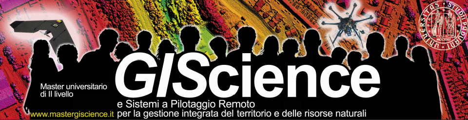

## GEOPROCESSING IN PYTHON

MASTER IN GISCIENCE E DRONI 2020 - Università di Padova

[(C)2020 CC-BY-SA](https://creativecommons.org/licenses/by-sa/3.0/it/) Enrico Ferreguti enricofer@gmail.com

* [Modulo 1: fondamenti di python - installazione - l'ambiente operativo](https://enricofer.github.io/geoprocessing_giscience_2019/20190414/master_2019_1.htm)
* [Modulo 2: funzioni, moduli e programmazione ad oggetti](https://enricofer.github.io/geoprocessing_giscience_2020/MODULI/modulo_2.htm)
* [Modulo 3: moduli, gestione dei pacchetti e strumenti di collaborazione](https://enricofer.github.io/geoprocessing_giscience_2020/MODULI/modulo_3)

